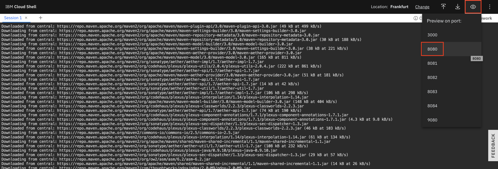
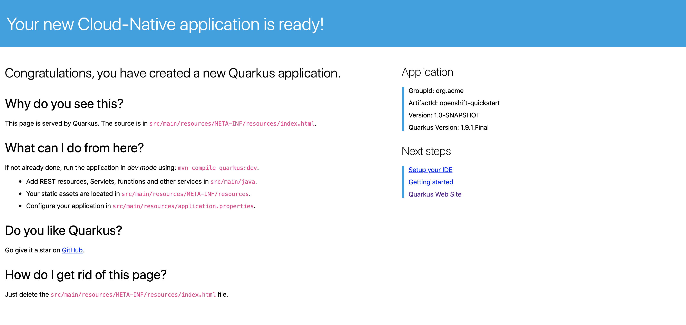
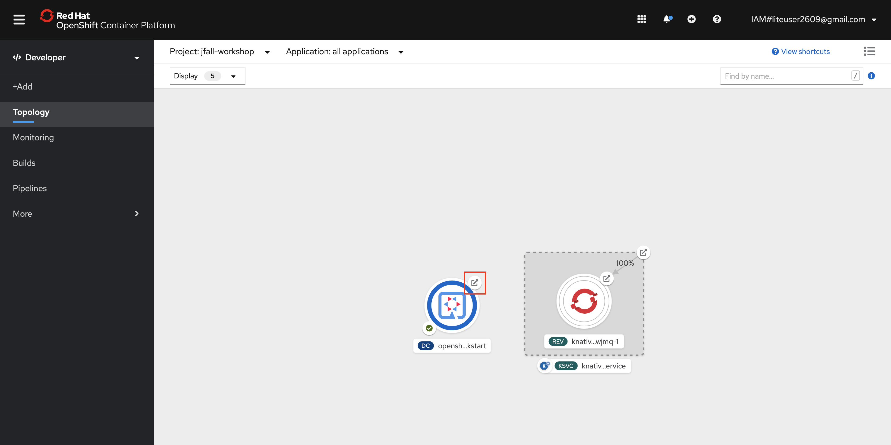

# Quarkus
This section desribes how to leverage the Quarkus framework to create and deploy a reactive Java app to OpenShift. It is heavily based on the official Quarkus [Deploying to OpenShift Guide](https://quarkus.io/guides/deploying-to-openshift).

## Generate a skeleton application

1. Switch tab to IBM Cloud Shell and change directory to your home dir.

```bash
$ cd ~
```

1. Now, let's bootstrap a new Quarkus application with the openshift extension activated by running:

```bash
mvn io.quarkus:quarkus-maven-plugin:1.9.1.Final:create \
    -DprojectGroupId=org.acme \
    -DprojectArtifactId=openshift-quickstart \
    -DclassName="org.acme.rest.GreetingResource" \
    -Dpath="/greeting" \
    -Dextensions="openshift"

cd openshift-quickstart
```

Note that it may take a while to download all the Maven dependecies needed. The project you just created contains a very simple class that returns `hello` on a `/greeting` HTTP GET request. Examine the code below. We're going to add some reactive code to it in the remainder of this section.

```java
package org.acme.rest;

import javax.ws.rs.GET;
import javax.ws.rs.Path;
import javax.ws.rs.Produces;
import javax.ws.rs.core.MediaType;

@Path("/greeting")
public class GreetingResource {

    @GET
    @Produces(MediaType.TEXT_PLAIN)
    public String hello() {
        return "hello";
    }
}
```

1. First, we check if the application behaves as expected. So we're gonna run it in the IBM Cloud shell. For this, type:

```bash
$ mvn compile quarkus:dev
```

and wait until you see that the application listens on port 8080

```
__  ____  __  _____   ___  __ ____  ______ 
 --/ __ \/ / / / _ | / _ \/ //_/ / / / __/ 
 -/ /_/ / /_/ / __ |/ , _/ ,< / /_/ /\ \   
--\___\_\____/_/ |_/_/|_/_/|_|\____/___/   
2020-11-04 11:22:15,018 WARN  [io.qua.dep.QuarkusAugmentor] (main) Using Java versions older than 11 to build Quarkus applications is deprecated and will be disallowed in a future release!
2020-11-04 11:22:26,613 WARN  [io.qua.kub.dep.KubernetesProcessor] (build-6) No registry was set for the container image, so 'ImagePullPolicy' is being force-set to 'IfNotPresent'.
2020-11-04 11:22:29,749 INFO  [io.quarkus] (Quarkus Main Thread) openshift-quickstart 1.0-SNAPSHOT on JVM (powered by Quarkus 1.9.1.Final) started in 15.147s. Listening on: http://0.0.0.0:8080
2020-11-04 11:22:29,752 INFO  [io.quarkus] (Quarkus Main Thread) Profile dev activated. Live Coding activated.
2020-11-04 11:22:29,752 INFO  [io.quarkus] (Quarkus Main Thread) Installed features: [cdi, kubernetes, resteasy]
```

1. Next, on the right of your screen, click on the view button and select port 8080



This opens the application URL in a new tab. It should look like



1. Now in the URL bar add `/greeting` to the application URL. This should now return: `hello`. 

1. Switch back to the IBM Cloud shell tab. You can now press \<CTRL-C\> to stop the application.

## Adding reactive code
In this section we will add reactive functionality to the application so the code behaves similar to the reactive Vert.x app that we created in section 3. We're gonna add a reactive class and we're gonna extend the GreetingResource class to leverage this new reactive class. Let's get started.

1. Although Quarkus is reactive -- under the hood your application is powered by a Vert.x engine -- you still need to write your code in a non-blocking manner to fully benefit from this behaviour. For this purpose having a reactive API is a must. Luckily Quarkus already took care of that and has an extension for this. To add this extension to your project, make sure you're in the `openshift-quickstart` directory and add execute:

```bash
$ mvn io.quarkus:quarkus-maven-plugin:1.9.1.Final:add-extensions -Dextensions="io.quarkus:quarkus-resteasy-mutiny"
```

The output should be similar to:

```
[INFO] Scanning for projects...
[INFO] 
[INFO] -------------------< org.acme:openshift-quickstart >--------------------
[INFO] Building openshift-quickstart 1.0-SNAPSHOT
[INFO] --------------------------------[ jar ]---------------------------------
[INFO] 
[INFO] --- quarkus-maven-plugin:1.9.1.Final:add-extensions (default-cli) @ openshift-quickstart ---
✅ Extension io.quarkus:quarkus-resteasy-mutiny has been installed
[INFO] ------------------------------------------------------------------------
[INFO] BUILD SUCCESS
[INFO] ------------------------------------------------------------------------
[INFO] Total time:  6.292 s
[INFO] Finished at: 2020-11-04T11:29:53Z
[INFO] ------------------------------------------------------------------------
```

1. Next, change directory to the `src/main/java/org/acme/rest` folder.

```bash
$ cd ~/openshift-quickstart/src/main/java/org/acme/rest
```

1. Create a new file `ReactiveGreetingService.java` with the following content:

```java
package org.acme.rest;

import io.smallrye.mutiny.Uni;
import javax.enterprise.context.ApplicationScoped;

@ApplicationScoped
public class ReactiveGreetingService {

    public Uni<String> greeting(String name) {
        return Uni.createFrom().item(name)
                .onItem().transform(n -> String.format("hello %s", name));
    }
}
```

Examine the class above. It uses the Mutiny `Uni` type to emit an item event `name`. Whenever an such an event is emitted, we transform the string `name` to `Hello name` and return this value. For more information on how exactly Mutiny works, see [Getting Started with Mutiny](https://smallrye.io/smallrye-mutiny/#_getting_started).

1. Next, the `GreetingResource` class needs to be changed so that it uses the code above. For this open the `GreetingResource.java` file in the `src/main/java/org/acme/rest` folder and add the following method to the `GreetingResource` class.

```java
    @Inject
    ReactiveGreetingService service;

    @GET
    @Produces(MediaType.TEXT_PLAIN)
    @Path("/greeting/{name}")
    public Uni<String> greeting(@PathParam String name) {
        return service.greeting(name);
    }
```

So, whenever a HTTP GET request on `greeting/{name}` comes in, the application returns the response `Hello {name}` in an asynchronous format. For your convenience, the complete source code of the `GreetingResource.java` should now be as follows:

```java
package org.acme.rest;

import javax.inject.Inject;
import javax.ws.rs.GET;
import javax.ws.rs.Path;
import javax.ws.rs.Produces;
import javax.ws.rs.core.MediaType;

import io.smallrye.mutiny.Uni;
import org.jboss.resteasy.annotations.jaxrs.PathParam;

@Path("/greeting")
public class GreetingResource {

    @Inject
    ReactiveGreetingService service;

    @GET
    @Produces(MediaType.TEXT_PLAIN)
    @Path("/{name}")
    public Uni<String> greeting(@PathParam String name) {
        return service.greeting(name);
    }

    @GET
    @Produces(MediaType.TEXT_PLAIN)
    public String hello() {
        return "hello";
    }
}
```

Recall that one of the beauties of Quarkus is that it allows you as developer to combine reactive programming -- in this case the `greeting()` method -- and imperative programming (the `hello()` method) in the same code :smiley:

1. Make to sure to save all your changes and run the application in the IBM Cloud Shell again by typing:

```bash
$ cd ~/openshift-quickstart
$ mvn compile quarkus:dev
```

1. Once the application started successfully and listens on port 8080, click the view icon on the top bar again. In the browser tab that opens, check both the `/greeting` and `/greeting/{name}` URLs to verify the application is working properly.

## Deploy the application to OpenShift
Now that we've added reactive code to our application, and make it look similar to the Vert.x app that we deployed earlier in the workshop, it is time to deploy the application to OpenShift. Lucky for us, Quarkus was designed and built with an eye for developer's joy , so deploying your code to OpenShift is really straightforward. However, first we make sure we're still using the right OpenShift project.

1. So for this, in the IBM Cloud Shell type:

```bash
$ oc project jfall-workshop
```

You should get the message that you're already using this project. If you get an error message that you're not authorized, it might be that you need to logon to OpenShift again using the 'Copy Login Command' from the OpenShift Web Console.

1. Next, make sure you're in the root folder of your project (typically `~/openshift-quickstart`) and type:

```bash
$ mvn clean package -Dquarkus.kubernetes.deploy=true -Dquarkus.openshift.expose=true
```

The Quarkus build that is trigger by the above command, optimizes the Java code, creates a runnable JAR and uses `s2i` to deploy the code as a container running on OpenShift. Two image streams will be created, one for the builder image and one for the output image. Wait for the process to complete successfully. This may take a minute or so. The parameter `quarkus.openshift.expose=true` exposes a route to the deployed application. 

1. Switch tab or open the OpenShift Web Console and select Topology in the the Developer perspective



1. Click the Route in the openshift-quickstart service to open the application in a separate tab.

1. Test the routes `greeting` and `greeting/{name}` again and verify they deliver the expected outcome.

### [Optional] Deploying the same Quarkus app as native binary

One of the benefits of Quarkus is the feature to create your application as native binary. You may choose for the native image option when you:

* need the highest memory density requirements
* need the highest request/s/MB for low heap size usages
* need a start-up time as fast as possible


To 
As both Docker and GraalVM are not available in the IBM Cloud Shell, we use an OpenShift pipeline again to get our code deployed. The code repository containing the code exactly as listed above is available at: (https://github.com/eciggaar/jfall-reactive-quarkus-greeting)


./mvnw clean package -Dquarkus.kubernetes.deploy=true


Now replace the application code of the GreetingResource class with the following code to mimic a Reactie Java app 

1. 
`oc project

